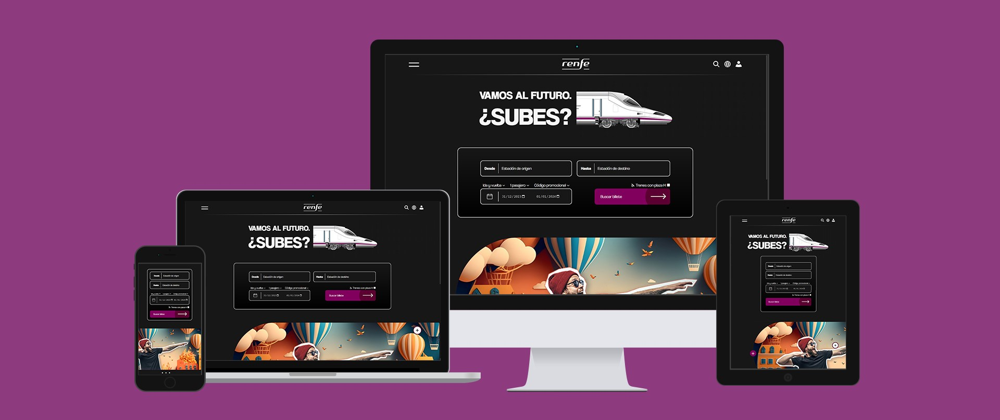

# 📌 **Resumen del proyecto**
¿De qué consta?

    RENFE es un proyecto web ficticio creado como ejercicio de rediseño.  
    La idea fue tomar como referencia la página oficial de Renfe y 
    reinterpretarla con un enfoque más moderno, limpio y funcional.  

    El objetivo principal fue trabajar la usabilidad, la jerarquía visual 
    y la experiencia de usuario en un sitio que, en la realidad, es clave 
    para miles de viajeros cada día.

    (Primera vez que utilizábamos JavaScript en un proyecto).

¿Quién es el cliente?

    No existe un cliente real. Se trata de un ejercicio académico para demostrar habilidades 
    en diseño UI/UX, desarrollo front-end y branding digital aplicado a un servicio público.

---

# 👀 **Ver proyecto**
🢆 🢆 **Clic** 🢇 🢇  

---

# ⚙️ **Tecnologías utilizadas**

- HTML5, CSS3 y JavaScript  
- Diseño responsive
- Despliegue en Netlify

---

> [!IMPORTANT]
> Este proyecto no tiene fines comerciales ni relación con la marca oficial RENFE.  
> Se ha realizado únicamente como práctica académica y portfolio de diseño/desarrollo.

---

## 📫 Contacta conmigo

- 🌐 Web: [morenomp.com](https://morenomp.com/)
- 💼 LinkedIn: [Marc Moreno Pineda](https://es.linkedin.com/in/marc-moreno-pineda)
- 🎥 YouTube: [@mmoreno-2004](https://www.youtube.com/@mmoreno-2004)
- 📧 Correo electrónico: morenomp2004@gmail.com
